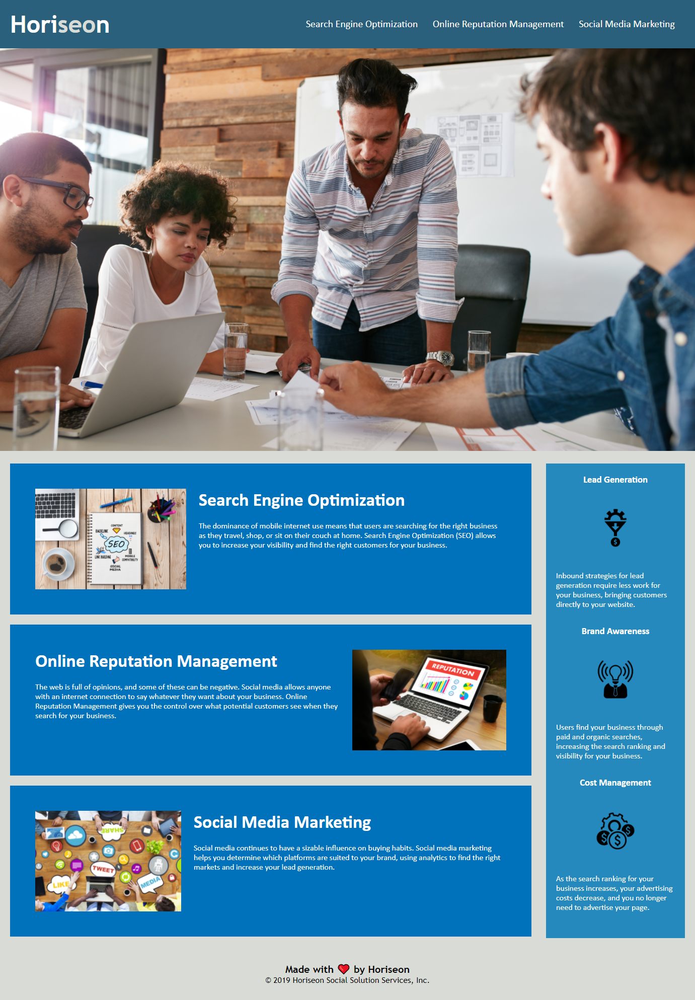

# Horiseon Refactor Project

## Description

In order to make this website more accessible and more prevalent in and better optimized for search engins, we have undertaken a full refactoring of the web code. This refactoring has solved a considerable readability issue for future coders and also has made the site much more accessible not only for SEO but also for those who would use alternative browsing means to access the site. We learned about proper CSS styling and organizing as well as implementation of semantic HTML to aid readability when going through complex code with multiple different, but related, sections of information and text/images. 

## Table of Contents (Optional)
If your README is long, add a table of contents to make it easy for users to find what they need.
- [Usage](#usage)
- [Credits](#credits)
- [License](#license)

## Usage
This site is to be used for interacting with us at Horiseon and finding best practices for your business/enterprise for getting the best Search Engine Optimization possible. This refactor was designed to make our site, in and of itself, more accessible, especially to persons with disabilities accessing the page via alternative browsing means (braille keyboards, screen readers, etc.). Below is a screenshot of the finished refactor for the main site page:
        
    

## Credits
For this project, we collaborated with [Mark Lindsey](https://github.com/mrl-jr), [Jamie Rossi](https://github.com/wjrossi), and [Dillon Koval](https://github.com/dillonkkoval) and used the following tutorials to make this refactor happen:
- [Professional README Guide](https://coding-boot-camp.github.io/full-stack/github/professional-readme-guide)
- [CSS Selectors](https://developer.mozilla.org/en-US/docs/Web/CSS/CSS_Selectors)
- [HTML 5 Semantic Elements](https://www.w3schools.com/html/html5_semantic_elements.asp)
## License
We will be using the following license for this project: [MIT License](https://choosealicense.com/licenses/mit/) 
